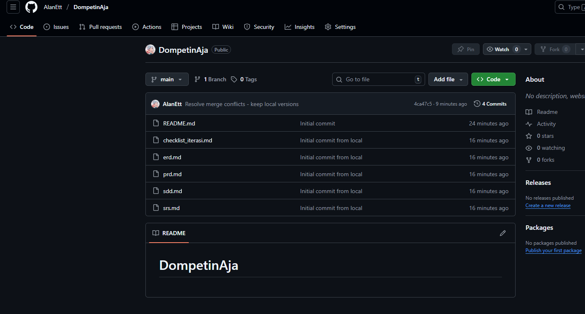
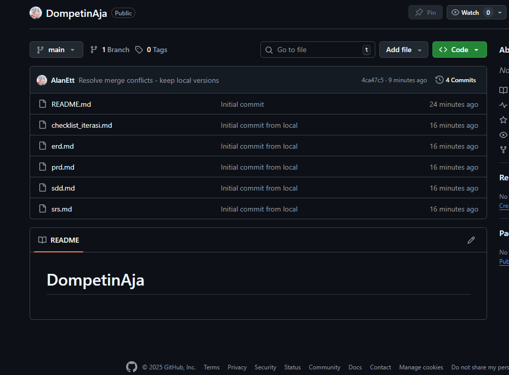

<div align="center">

# DompetinAja

Catatan keuangan pribadi yang simpel, cepat, dan powerful. Kelola multi-dompet, transaksi, budgeting, utang/piutang, hingga transaksi berulang — semuanya di satu tempat.


</div>

---

## ✨ Fitur Utama
- **Multi-Dompet**: Kelola beberapa akun/dompet (Tunai, Bank, e-Wallet).
- **Transaksi Pemasukan/Pengeluaran**: CRUD transaksi dengan kategori, tanggal, dan deskripsi.
- **Kategori Kustom**: Atur kategori pemasukan/pengeluaran sesuai kebutuhan.
- **Dashboard & Grafik**: Ringkasan visual (pie & bar chart) untuk analisis cepat.
- **Budgeting Bulanan**: Tetapkan anggaran per kategori dan pantau progresnya.
- **Utang/Piutang**: Catat, pantau status, dan tandai saat lunas.
- **Transaksi Berulang**: Otomatiskan transaksi rutin (gaji, langganan, dll.).
- **Ekspor CSV**: Simpan dan analisis data transaksi di spreadsheet.

---

## 🧭 Dokumentasi Proyek
- PRD (Product Requirements Document): [`prd.md`](./prd.md)
- SRS (Software Requirements Specification): [`srs.md`](./srs.md)
- SDD (Software Design Document): [`sdd.md`](./sdd.md)
- ERD (Entity Relationship Diagram): [`erd.md`](./erd.md)
- Roadmap / Checklist Sprint: [`checklist_iterasi.md`](./checklist_iterasi.md)

---

## 🏗️ Arsitektur & Teknologi
- Flutter (UI)
- Riverpod + Riverpod Generator (State Management)
- Drift/Moor (ORM untuk SQLite, reactive queries)
- Go Router (Navigasi)
- Freezed (Model immutable)
- fpdart (Either untuk error handling eksplisit)
- Logger (Pengembangan & debugging)

Struktur mengikuti prinsip Clean Architecture: `presentation` ← `domain` ← `data`.

---

## 🚀 Memulai Pengembangan
1. Pastikan Flutter terpasang: `flutter --version`.
2. Clone repository:
```bash
git clone https://github.com/AlanEtt/DompetinAja.git
cd DompetinAja
```
3. Install dependencies:
```bash
flutter pub get
```
4. (Opsional) Generate code:
```bash
dart run build_runner build --delete-conflicting-outputs
```
5. Jalankan aplikasi:
```bash
flutter run
```

---

## 🗺️ Roadmap Singkat (MVP 7 Minggu)
Lihat detilnya di [`checklist_iterasi.md`](./checklist_iterasi.md). Ringkasan:

- Minggu 1: Fondasi proyek & skema database
- Minggu 2: Dompet & transaksi dasar (UI + data)
- Minggu 3: Dashboard & visualisasi awal
- Minggu 4: Budgeting end-to-end
- Minggu 5: Utang/Piutang
- Minggu 6: Transaksi berulang & filter lanjutan
- Minggu 7: Finalisasi, pengujian, polish, dan rilis internal

---

## 👥 Tim Pengembang
Kelompok: DompetinAja

1. Rizki Alan Habibi
2. Angga Adiloka
3. Zanuar Rizal Kurniawan

---

## 📦 Status Rilis
- Tahap: Perencanaan MVP dan penyusunan arsitektur
- Target: Rilis internal setelah Sprint 7

---

## 🤝 Kontribusi
Pull request dan issue dipersilakan. Mohon sertakan deskripsi yang jelas, langkah reproduksi (jika bug), dan tangkapan layar saat relevan.

---

## 📸 Cuplikan Layar (Placeholder)
Tambahkan di kemudian hari:
- Beranda / Dashboard
- Daftar Transaksi
- Form Tambah Transaksi
- Halaman Budgeting

<sub>Repository: `https://github.com/AlanEtt/DompetinAja`</sub>